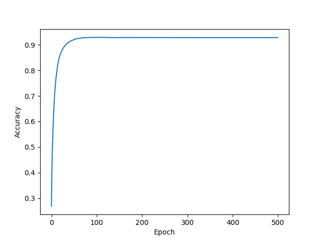
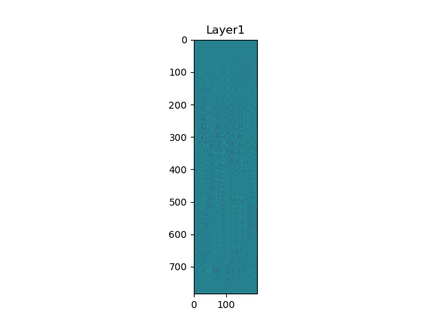
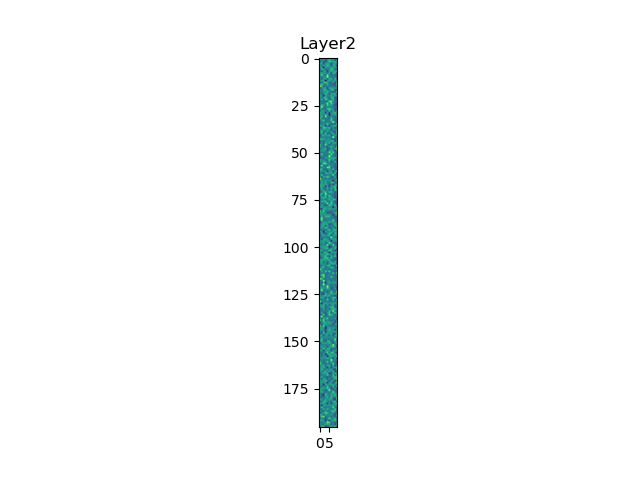

## Two-layer neural network
The model is saved at https://drive.google.com/drive/folders/1T_Z8p3V_rMCgwRSWEI3P5c4owC_wZGYh?usp=sharing

### Training
`python train.py`
Train the model with default hyperparameter setting. Please refer to `Parameter tunning` to search the best hyperparameters.
The accuracy of valid dataset is as follow.

### Parameter tunning
`python gird_search.py`
Save model as `saved/model_gridsearch.pkl`
Save the best hyperparameters as `saved/hparams_gridsearch.json`

### Testing
Test and visualize the results with testing dataset
`python eval.py`

### File Structure
`modules.py`: Model components and loss function
`utils.py`: Data loader and visualization utils 

### modules.py
Define the neural network module and loss function.

### Visualization
The visualization of model parameters are as follows.
To insert an image in markdown, you can use the following syntax:

